# Mips Processor
This is single-cycle MIPS implementation in Verilog. It is a 32-bit processor with 32 registers. <br>
It supports 16 instructions. The instructions are including jump, jal, jr, beq, bne. Details of the instructions are listed below. <br>
Simulation is done in ModelSim. Screenshots of the simulation are also included below.

## Datapath

<br>
You can find more details about the mux namings in the end.

## Instructions
| Binary Opcode | Instruction | Hex |
|:---:|:---:|:---:|
| 000000 | R-type | 00 |
| 100011 | lw | 23 |
| 101011 | sw | 2B |
| 001000 | addi | 08 |
| 000010 | jump | 02 |
| 000011 | jal | 03 |
| 000100 | beq | 04 |
| 000101 | bne | 05 |

<br>

## Controller
| Instruction | RegDest | AluSrc | MemToReg | RegWrite | MemRead | MemWrite | BranchEq | BranchNotEq | AluOp1 | AluOp0 | Jump | Jal | Jr
| :---: | :---: | :---: | :---: | :---: | :---: | :---: | :---: | :---: | :---: | :---: | :---: | :---: | :---: |
| R-format | 1 | 0 | 0 | 1 | 0 | 0 | 0 | 0 | 1 | 0 | 0 | 0 | 0 |
| R-format (Jr) | 1 | 0 | 0 | 1 | 0 | 0 | 0 | 0 | 1 | 0 | 0 | 0 | 1 |
| lw | 0 | 1 | 1 | 1 | 1 | 0 | 0 | 0 | 0 | 0 | 0 | 0 | 0 |
| sw | X | 1 | X | 0 | 0 | 1 | 0 | 0 | 0 | 0 | 0 | 0 | 0 |
| addi | 0 | 1 | 0 | 1 | 0 | 0 | 0 | 0 | 0 | 0 |  0| 0 | 0 |
| jump | X | X | X | 0 | 0 | 0 | 0 | 0 | X | X | 1 | 0 | 0 |
| jal | X | X | 0 | 1 | 0 | 0 | 0 | 0 | X | X | 1 | 1 | 0 |
| beq | X | 0 | X | 0 | 0 | 0 | 1 | 0 | 0 | 1 | 0 | 0 | 0 |
| bne | X | 0 | X | 0 | 0 | 0 | 0 | 1 | 0 | 1 | 0 | 0 | 0 |

<br>

## ALU
| Instruction Opcode | ALU Op | Instruction Operation | Function Field | ALU Action | Alu Control Input |
| :---: | :---: | :---: | :---: | :---: | :---: |
| R-format | 10 | NOR | 100001 | NOR | 0011 |
| R-format | 10 | add | 100000 | add | 0010 |
| R-format | 10 | subtract | 100010 | subtract | 0110 |
| R-format | 10 | AND | 100100 | AND | 0000 |
| R-format | 10 | OR | 100101 | OR | 0001 |
| R-format | 10 | set on less than | 101010 | set on less than | 0111 |
| R-format | 10 | jr | 001000 | rt | 1000 |
| lw | 00 | load word | XXXXXX | add | 0010 |
| sw | 00 | store word | XXXXXX | add | 0010 |
| addi | 00 | add immediate | XXXXXX | add | 0010 |
| beq | 01 | branch equal | XXXXXX | subtract | 0110 |  
| bne | 01 | branch not equal | XXXXXX | subtract | 0110 |

<br>

## Code
### Instructions
Here are the instructions that are used in the simulation and the conversion of them to binary then to hex. After the conversion, the instructions are added to the instruction_memory.dat file. Since the instructions are 32-bit and the memory is 8-bit, the instructions are divided into 4 parts and added to the memory. <br>

0) addi $0, $0, 5 <br>
001000 00000 00000 0000000000000101 <br>
20000005
1) sw $0, 4($5) <br>
101011 00101 00000 0000000000000100 <br>
ACA00004
2) lw $1, 4($5) <br>
100011 00101 00001 0000000000000100 <br>
8CA10004
3) beq $0, $1, 3 <br>
000100 00001 00000 0000000000000011 <br>
10200003
4) add $2, $0, $1 <br>
000000 00000 00001 00010 00000 100000 <br>
00011020
5) jal 8 <br>
000011 00000000000000000000001000 <br>
0C000008
6) bne $0, $3, 3 <br>
000101 00011 00000 0000000000000011 <br>
14600003
7) j 4 <br>
000010 00000000000000000000000100 <br>
08000004
8) addi $3, $0, 1 <br>
001000 00000 00011 0000000000000001 <br>
20030001
9) jr $31 <br>
000000 11111 00000 00000 00000 001000 <br>
03E00008
10) addi $7, $7, 16 <br>
001000 00111 00111 0000000000010000 <br>
20E70010
11) addi $8, $8, -4 <br>
001000 01000 01000 1111111111111100 <br>
2108FFFC
12) sw $8, 4($7) <br>
101011 00111 01000 0000000000000100 <br>
ACE80004
13) lw $9, 4($7) <br>
100011 00111 01001 0000000000000100 <br>
8CE90004

<br>

## ModelSim
### Create a new project
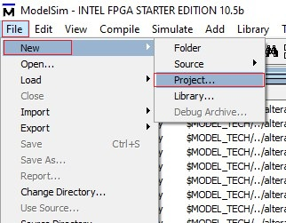

<br>

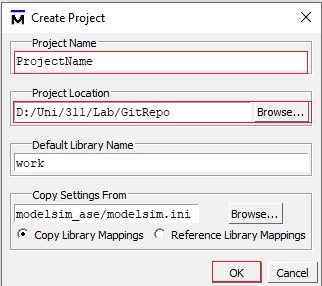

### Add files to the project
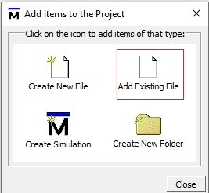

<br>

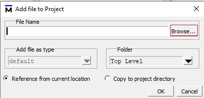

<br>

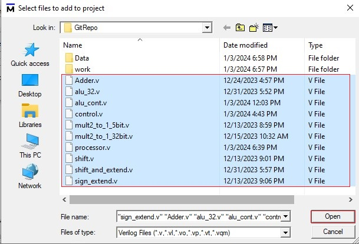

You could also add dat files to the project with the same way.

### Compile the files
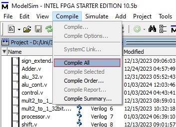

<br>

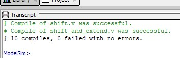

### Simulate the files
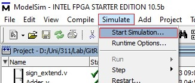

<br>

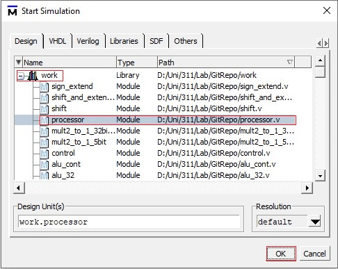

#### Adding signals to the wave
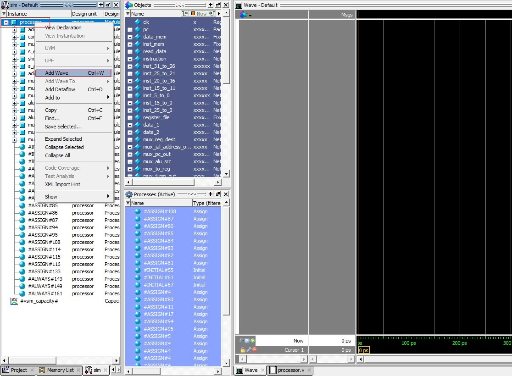

#### Radix change
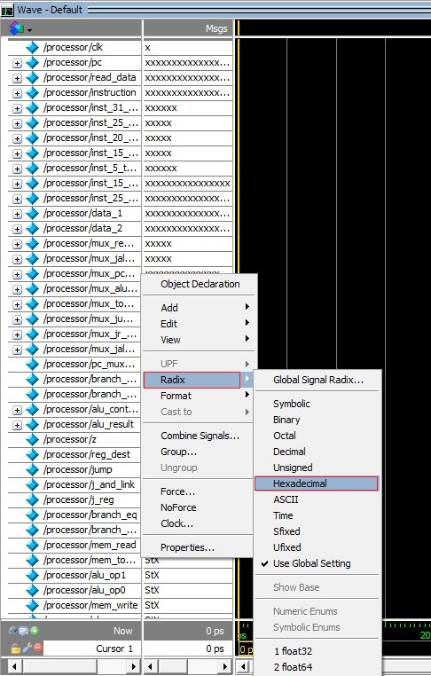

To see the values better, you can change the radix to hexadecimal. First select the signals you want to change the radix (You could select all signals by pressing Ctrl+A). Then right click on the signals and select radix change. Then select hexadecimal or any other radix you want.

#### Simulation
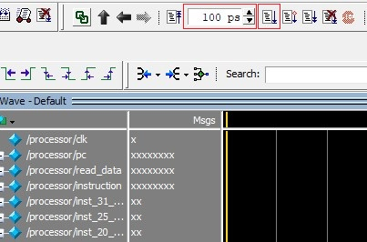

First you need to run the simulation. You can change the time of the simulation by changing the value in the box. Every instruction takes 40ps except first run (It takes 20ps). Then you can see the values of the signals in the wave.

<br>

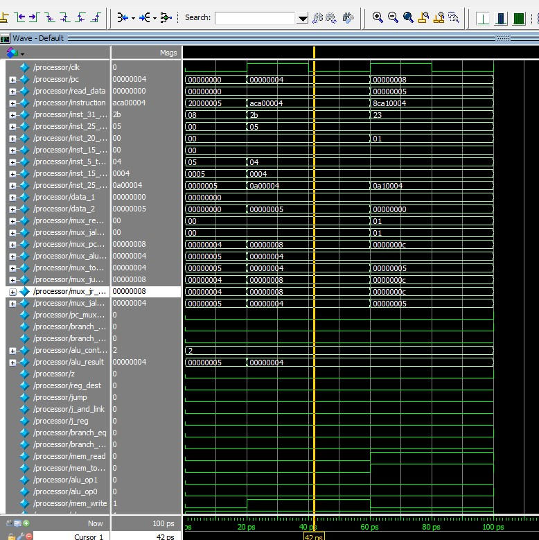

### Viewing memory and registers

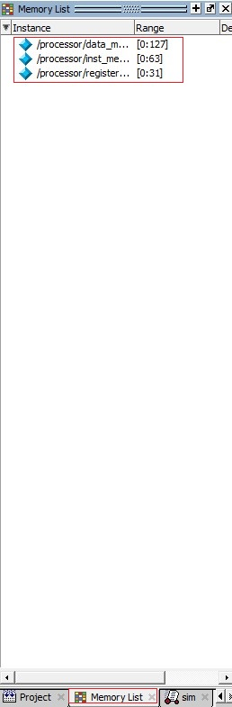

<br>

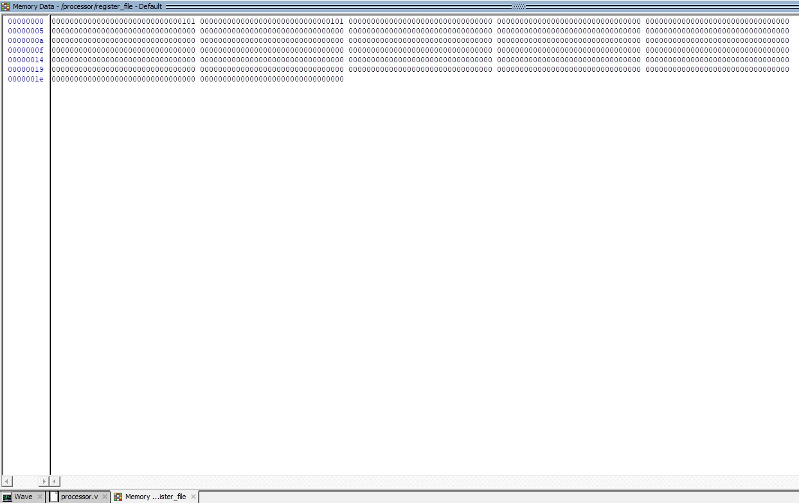

<br>

## Notes
- In processor there is a limit for the number of instructions. You can change the limit by changing the value of instruction_memory in the processor.v file. 
- If you add less instructions than the limit, it will make the rest of the instructions 0. This could cause problems in the simulation. So you should be careful about the number of instructions you add. (It is not a big problem, you can just ignore the rest of the instructions in the simulation but it could be annoying or confusing.)
- Simulation is set to finish after 620ps. You can change this in
```verilog
begin
    #620 $finish;
end
```
in the processor.v file. Be careful when the simulation finishes. It asks you want to close the simulation. If you click yes, it will close the application. So you should click no and you can still wave.
- If you still run the simulation after 620ps, you can see instructions starting from the beginning. This is because of instruction is taken from the instruction memory with last 6 bits of the program counter. You could use all bits of the program counter to avoid this problem. But it is not a big problem, you can just ignore the instructions starting from the beginning. It just set to 6 bit because since instruction memory is 64 bit long, it is enough to use 6 bits of the program counter.

<br>

## Details of the datapath
You can see mux namings. <br>

#### Mux1


<br>

#### Mux2 and Mux3


<br>

#### Mux4


<br>

#### Mux5


<br>

#### Mux6


<br>

#### Mux7


<br>

#### Mux8
